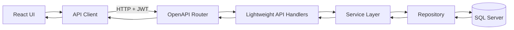

# Weather App

A full-stack weather management application. Users register, authenticate, and manage weather zones (saved locations) with real-time temperature data.

<video width="800" controls>
  <source src="app_demo.mp4" type="video/mp4">
  Your browser does not support the video tag.
</video>

## High Level Flow



## Architecture

- **Backend**: Flask REST API with OpenAPI specification
- **Frontend**: React SPA with TypeScript
- **Database**: Microsoft SQL Server (primary), SQLite (fallback for testing)

## Tech Stack

**Backend**: Python 3.10+, Flask, Connexion, SQLAlchemy, Pydantic, Pytest  
**Frontend**: React 18, TypeScript, Vite, Base Web, React Router  
**Database**: Microsoft SQL Server 2019, SQLite (testing)

## Quick Start

### Prerequisites

- Docker Desktop
- Docker Compose

### Running with Docker Compose

1. **Create environment file**:
   ```bash
   cp .env.example .env
   ```

2. **Start all services**:
   ```bash
   docker-compose up --build
   ```

3. **Access the application**:
   - Frontend: http://localhost:3000
   - Backend API: http://localhost:8080/api/v1
   - API Documentation: http://localhost:8080/api/v1/ui/

The `.env` file configures database credentials, ports, and secrets. See `.env.example` for available options.

## Project Structure

```
weather-app/
├── backend/          # Flask REST API
│   └── README.md     # Backend documentation
├── frontend/         # React application
│   └── README.md     # Frontend documentation
├── docker-compose.yml
└── README.md         # This file
```

## Documentation

- **Backend**: See [backend/README.md](backend/README.md) for API architecture, setup, and configuration
- **Frontend**: See [frontend/README.md](frontend/README.md) for frontend structure, authentication, and development

## API Endpoints

**Authentication**
- `POST /api/v1/auth/register` - Register new user
- `POST /api/v1/auth/login` - Login and receive JWT token

**Zones**
- `GET /api/v1/zones` - List user's zones
- `POST /api/v1/zones` - Create zone
- `PUT /api/v1/zones/{id}` - Update zone
- `DELETE /api/v1/zones/{id}` - Delete zone
- `POST /api/v1/zones/{id}/refresh` - Refresh weather data

**Cities**
- `GET /api/v1/cities/search?q={name}` - Search cities

Full API documentation available at http://localhost:8080/api/v1/ui/ when running.

## Testing

```bash
# Backend tests
cd backend
python -m pytest tests
```

## Local Development

For local development without Docker, see:
- [backend/README.md](backend/README.md) - Backend setup and configuration
- [frontend/README.md](frontend/README.md) - Frontend setup and development
