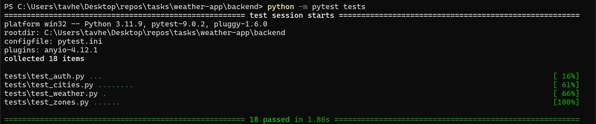

# Weather App Backend

A robust, layered REST API backend for managing weather zones and fetching real-time weather data. Built with Python, Flask, and Connexion, following an OpenAPI-first design approach.

## 1. Project Overview

*   **Authentication**: Secure JWT-based auth with Argon2 password hashing.
*   **City Search**: Search for cities by name using Open-Meteo Geocoding API.
*   **Zone Management**: CRUD operations for weather zones with strict multi-tenancy (users manage only their own zones).
*   **Weather Integration**: Real-time weather fetching via Open-Meteo API.
*   **Observability**: Structured, production-ready logging.

**Tech Stack**:
*   Python 3.10+
*   Flask & Connexion (OpenAPI 3.0)
*   SQLAlchemy (ORM) with **Microsoft SQL Server** (Primary) or SQLite (Fallback)
*   Pydantic (Data Validation)
*   Pytest (Testing)

## 2. Architecture

The application follows a strict layered architecture to ensure separation of concerns:

1.  **API Layer (`app/api`)**: Handles HTTP requests, input validation (via OpenAPI), and session lifecycle.
2.  **Service Layer (`app/services`)**: Contains business logic (Auth, Zones, Weather). Services are stateless.
3.  **Repository Layer (`app/repo`)**: Abstraction for data access. **Multi-tenancy** is enforced here via a base `UserScopedRepository` that automatically filters data by the authenticated user.
4.  **Database**: SQLAlchemy models map to Microsoft SQL Server tables (or SQLite for local development).

**Design**:
*   **Request-Scoped Sessions**: Database sessions managed via context manager with auto-commit/rollback per request
*   **Provider Isolation**: Weather service encapsulates external API (Open-Meteo) for easy replacement

## 3. Project Structure

```text
backend/
├── app/
│   ├── api/            # Controllers / Route Handlers
│   ├── core/           # Config, Database, Logging, Security, Exceptions
│   ├── dtos/           # Pydantic Data Transfer Objects
│   ├── models/         # SQLAlchemy Database Models
│   ├── repo/           # Data Access Layer (Repositories)
│   └── services/       # Business Logic Layer
├── openapi/
│   └── openapi.yaml    # OpenAPI 3.0 Specification
├── tests/              # Pytest Suite (Integration Tests)
├── requirements.txt    # Project Dependencies
└── run.py              # Application Entry Point
```

## 4. Setup & Running

The application supports **Microsoft SQL Server** as the primary database, with SQLite available as a testing fallback.

### Docker Compose

Run via Docker Compose from the project root. See root [README.md](../README.md) for setup instructions.

### Local Development

**Prerequisites**: 
*   Python 3.10+
*   Microsoft SQL Server (or use Docker for database only: `docker-compose up db -d`)
*   **ODBC Driver 18 for SQL Server** (Required on Windows for MSSQL)

**Installing ODBC Driver 18 for SQL Server (Windows)**:
1. Download from: https://learn.microsoft.com/en-us/sql/connect/odbc/download-odbc-driver-for-sql-server
2. Install "ODBC Driver 18 for SQL Server"
3. Restart your terminal/PowerShell after installation
4. Verify installation:
   ```powershell
   Get-OdbcDriver | Where-Object {$_.Name -like "*SQL Server*"}
   ```

**Steps**:
1.  **Setup Python environment**:
    ```bash
    python -m venv .venv
    .venv\Scripts\Activate.ps1  # Windows
    # source .venv/bin/activate  # Linux/Mac
    pip install -r requirements.txt
    ```

2.  **Configure connection**:
    Set the `DATABASE_URL` environment variable to point to your MSSQL instance:
    ```powershell
    # Windows PowerShell - Connect to Docker database
    $env:DATABASE_URL="mssql+pyodbc://sa:<your_password>@localhost:1433/weather_app?driver=ODBC+Driver+18+for+SQL+Server&TrustServerCertificate=yes"
    
    # Windows PowerShell - Connect to local SQL Server
    $env:DATABASE_URL="mssql+pyodbc://sa:<your_password>@localhost:1433/weather_app?driver=ODBC+Driver+18+for+SQL+Server&TrustServerCertificate=yes"
    ```
    
    ```bash
    # Linux/Mac
    export DATABASE_URL="mssql+pyodbc://sa:<your_password>@localhost:1433/weather_app?driver=ODBC+Driver+18+for+SQL+Server&TrustServerCertificate=yes"
    ```

3.  **Run the application**:
    ```bash
    python run.py
    ```

**Note**: The application code does not change. Only the connection string differs.

**Troubleshooting ODBC Driver Issues**:
- **Error: "Data source name not found"**: ODBC Driver 18 is not installed. Install it from the link above.
- **Error: "Driver not found"**: Check the driver name matches exactly: `ODBC+Driver+18+for+SQL+Server` (with spaces encoded as `+`)
- **Alternative**: Use SQLite fallback (see section C) - no driver installation needed

### SQLite (Testing Fallback)

SQLite is available as a testing fallback. Used automatically when `DATABASE_URL` is not set.

**Setup**:
```bash
python -m venv .venv
source .venv/bin/activate  # Windows: .venv\Scripts\activate
pip install -r requirements.txt
python run.py
```

No database configuration needed. Creates `weather.db` automatically.

## 5. Configuration

| Variable | Description | Default |
| :--- | :--- | :--- |
| `DATABASE_URL` | Database connection string | `sqlite:///weather.db` |
| `SECRET_KEY` | JWT signing key | `dev_secret_key_change_in_production` |
| `LOG_LEVEL` | Logging level | `INFO` |
| `WEATHER_PROVIDER_BASE_URL` | Weather API endpoint | `https://api.open-meteo.com/v1/forecast` |
| `CITY_GEOCODING_BASE_URL` | City geocoding API endpoint | `https://geocoding-api.open-meteo.com/v1/search` |

**MSSQL Connection String Format**:
```
mssql+pyodbc://sa:<password>@HOST:1433/weather_app?driver=ODBC+Driver+18+for+SQL+Server&TrustServerCertificate=yes
```

## 6. API Documentation

Interactive API documentation available at http://localhost:8080/api/v1/ui/ when the server is running.

All endpoints require JWT authentication except `/auth/register` and `/auth/login`.

## 7. Testing

The project includes an integration test suite using `pytest` and an in-memory SQLite database.

```bash
# Run all tests
python -m pytest tests

# Run specific file
python -m pytest tests/test_zones.py
```


**Scope**: Tests cover Authentication flows, City Search functionality, Zone CRUD operations, Multi-tenant data isolation, and Weather Service integration (mocked).

