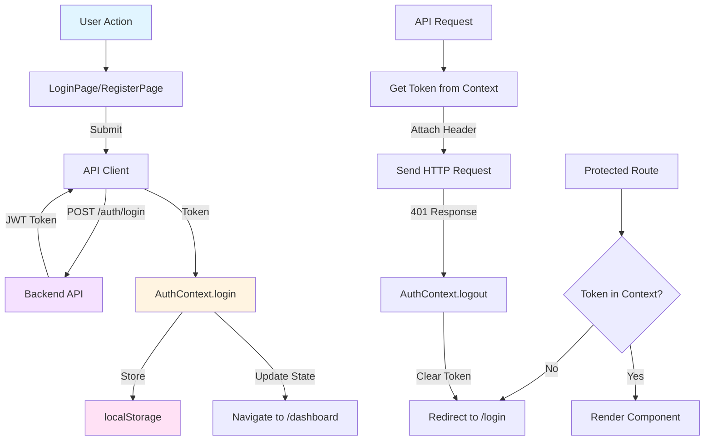
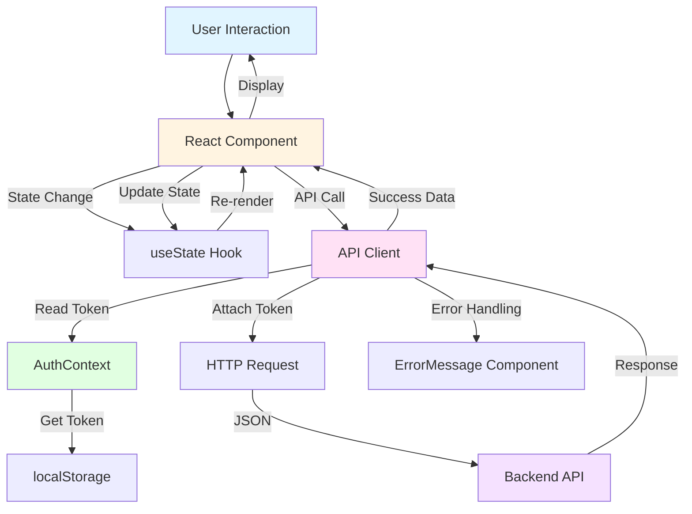

# Weather App Frontend

React TypeScript application for managing weather zones with real-time temperature data.

## Tech Stack

- **React 18** with TypeScript
- **Vite** - Build tool and dev server
- **Base Web** - UI component library
- **React Router** - Client-side routing
- **React Context API** - Global state management

## Project Structure

```
frontend/
├── src/
│   ├── api/              # API client and HTTP utilities
│   │   └── client.ts      # Centralized API client with error handling
│   ├── components/        # Reusable UI components
│   │   ├── CitySearch.tsx
│   │   ├── ErrorMessage.tsx
│   │   ├── ZoneCard.tsx
│   │   └── ZoneList.tsx
│   ├── contexts/          # React contexts
│   │   └── AuthContext.tsx # JWT authentication state
│   ├── pages/             # Route components
│   │   ├── DashboardPage.tsx
│   │   ├── LoginPage.tsx
│   │   └── RegisterPage.tsx
│   ├── types/             # TypeScript type definitions
│   │   └── api.ts         # API response types
│   ├── App.tsx            # Root component and routing
│   ├── main.tsx           # Application entry point
│   └── util.ts            # Utility functions
├── package.json
├── vite.config.ts         # Vite configuration
└── tsconfig.json          # TypeScript configuration
```

## Authentication

The frontend uses JWT-based authentication:

1. **Token Storage**: JWT access tokens stored in `localStorage`
2. **AuthContext**: Global authentication state managed via React Context
3. **API Client**: Automatically attaches `Authorization: Bearer <token>` header to requests
4. **Route Protection**: Unauthenticated users redirect to `/login`

### Authentication Flow



### Component Interaction Flow



## API Integration

The frontend communicates with the backend via a centralized API client (`src/api/client.ts`):

- **Base URL**: Configured via `VITE_API_BASE_URL` (defaults to `/api/v1` in production)
- **Error Handling**: Centralized error mapping with context-aware messages
- **Authentication**: Automatic JWT token attachment from `AuthContext`
- **Request/Response**: Type-safe with TypeScript interfaces

**Development Proxy**: When running locally with `npm run dev`, Vite proxies `/api` requests to `http://localhost:8080`.

## Running the Frontend

### Option 1: Docker Compose (Recommended)

The frontend is included in the root `docker-compose.yml`:

```bash
# From project root
docker-compose up --build
```

Frontend available at http://localhost:3000

### Option 2: Local Development

1. **Install dependencies**:
   ```bash
   cd frontend
   npm install
   ```

2. **Start development server**:
   ```bash
   npm run dev
   ```

   Frontend available at http://localhost:3000

   The Vite dev server proxies API requests to `http://localhost:8080` (configured in `vite.config.ts`).

3. **Build for production**:
   ```bash
   npm run build
   ```

   Outputs to `dist/` directory, ready for static hosting.

## Environment Variables

- `VITE_API_BASE_URL` - Backend API base URL (default: `/api/v1`)

For Docker deployments, the API base URL is configured automatically.

## Development

**Hot Module Replacement**: Vite provides instant updates during development.

**TypeScript**: Full type checking. Run `npm run build` to verify types.

**Linting**: Configure ESLint/TypeScript compiler for code quality.

## Component Overview

- **LoginPage/RegisterPage**: Authentication forms
- **DashboardPage**: Main application view with zone management
- **CitySearch**: City search and zone creation
- **ZoneList/ZoneCard**: Display and manage weather zones
- **ErrorMessage**: Consistent error display component
